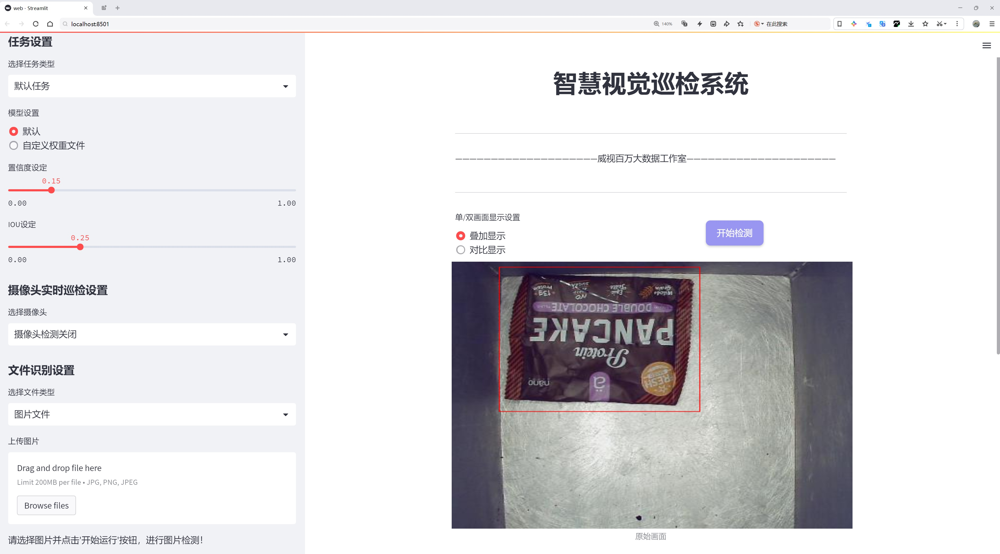
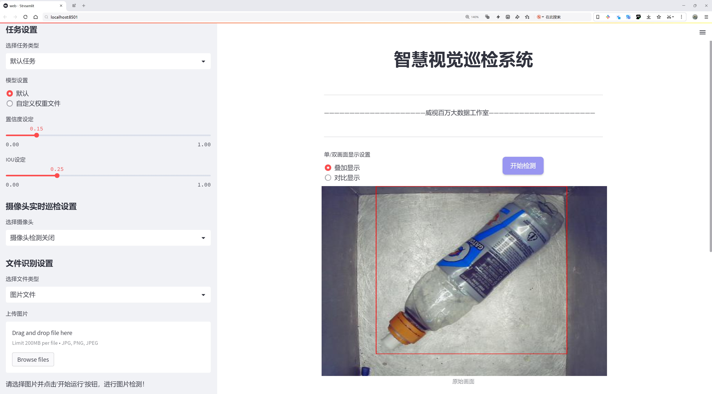
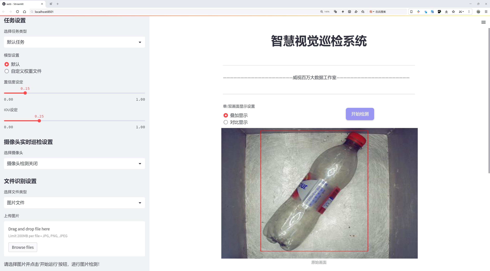
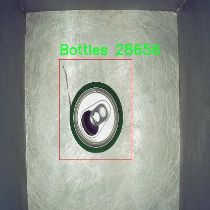
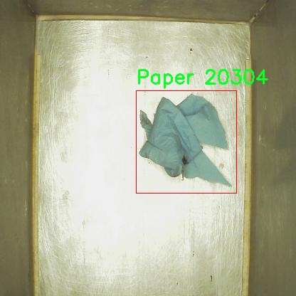
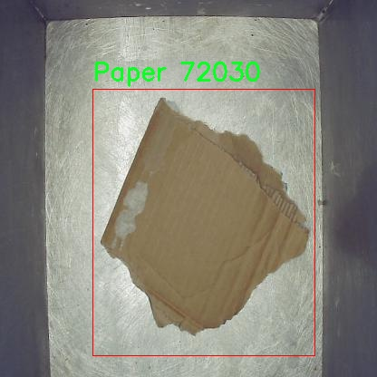
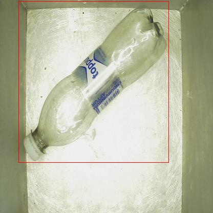
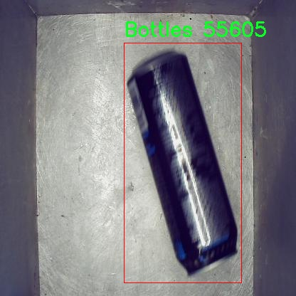

# 垃圾分类检测检测系统源码分享
 # [一条龙教学YOLOV8标注好的数据集一键训练_70+全套改进创新点发刊_Web前端展示]

### 1.研究背景与意义

项目参考[AAAI Association for the Advancement of Artificial Intelligence](https://gitee.com/qunmasj/projects)

项目来源[AACV Association for the Advancement of Computer Vision](https://kdocs.cn/l/cszuIiCKVNis)

研究背景与意义

随着城市化进程的加快和人口的不断增长，垃圾处理问题日益严重，成为全球范围内亟待解决的环境问题之一。根据联合国环境规划署的报告，全球每年产生的垃圾量以每年约2亿吨的速度增长，其中塑料垃圾、纸张和瓶子等可回收物品占据了相当大的比例。有效的垃圾分类不仅能够减少垃圾填埋的压力，还能促进资源的循环利用，降低环境污染。因此，建立一个高效、准确的垃圾分类检测系统，能够为垃圾分类的智能化和自动化提供技术支持，具有重要的社会和经济意义。

在此背景下，基于深度学习的目标检测技术逐渐成为垃圾分类检测领域的研究热点。YOLO（You Only Look Once）系列模型因其高效的实时检测能力和较高的准确率，广泛应用于各类目标检测任务。YOLOv8作为该系列的最新版本，结合了多种先进的网络结构和算法优化，展现出更强的特征提取能力和更快的推理速度。然而，现有的YOLOv8模型在特定应用场景下，尤其是针对垃圾分类这一复杂环境中的目标检测，仍然存在一定的局限性，如对不同类别垃圾的识别准确率不足、对背景干扰的敏感性较高等。因此，改进YOLOv8模型以提升其在垃圾分类检测中的性能，具有重要的研究价值。

本研究所使用的数据集“Trash in real background”包含1572张真实场景下的垃圾图像，涵盖了瓶子、纸张和塑料三类垃圾。这一数据集的构建不仅考虑了图像的多样性和复杂性，还力求反映现实生活中垃圾的真实分布情况，为模型的训练和测试提供了丰富的样本。这种真实背景下的垃圾图像数据，能够有效提高模型的泛化能力，使其在实际应用中表现得更加稳健。通过对这一数据集的深入分析与挖掘，我们能够识别出影响垃圾分类检测效果的关键因素，从而为后续的模型改进提供依据。

本研究的意义不仅在于提升YOLOv8在垃圾分类检测中的性能，更在于推动智能垃圾分类技术的发展。通过改进后的检测系统，能够实现对垃圾的自动识别与分类，从而减少人工分类的工作量，提高分类效率，降低人为错误的发生率。此外，研究成果还可为城市垃圾管理提供数据支持，助力实现更为科学的垃圾处理和资源回收策略，进而推动可持续发展目标的实现。

综上所述，基于改进YOLOv8的垃圾分类检测系统的研究，不仅具有重要的理论意义，也在实践中具有广泛的应用前景。通过深入探索和解决现有技术在垃圾分类中的不足，我们期待能够为环境保护和资源利用提供新的解决方案，为建设美丽城市贡献一份力量。

### 2.图片演示







##### 注意：由于此博客编辑较早，上面“2.图片演示”和“3.视频演示”展示的系统图片或者视频可能为老版本，新版本在老版本的基础上升级如下：（实际效果以升级的新版本为准）

  （1）适配了YOLOV8的“目标检测”模型和“实例分割”模型，通过加载相应的权重（.pt）文件即可自适应加载模型。

  （2）支持“图片识别”、“视频识别”、“摄像头实时识别”三种识别模式。

  （3）支持“图片识别”、“视频识别”、“摄像头实时识别”三种识别结果保存导出，解决手动导出（容易卡顿出现爆内存）存在的问题，识别完自动保存结果并导出到tempDir中。

  （4）支持Web前端系统中的标题、背景图等自定义修改，后面提供修改教程。

  另外本项目提供训练的数据集和训练教程,暂不提供权重文件（best.pt）,需要您按照教程进行训练后实现图片演示和Web前端界面演示的效果。

### 3.视频演示

[3.1 视频演示](https://www.bilibili.com/video/BV1hPx7esEpu/)

### 4.数据集信息展示

##### 4.1 本项目数据集详细数据（类别数＆类别名）

nc: 3
names: ['Bottles', 'Paper', 'Plastic']


##### 4.2 本项目数据集信息介绍

数据集信息展示

在现代社会中，垃圾分类已成为环境保护和资源回收的重要环节。为了提高垃圾分类的准确性和效率，开发出一套高效的垃圾分类检测系统显得尤为重要。本研究选用的数据集名为“Trash in real background”，旨在为改进YOLOv8的垃圾分类检测系统提供强有力的支持。该数据集专注于真实环境中的垃圾物品，具有较高的实用价值和应用前景。

“Trash in real background”数据集包含三种主要类别，分别是瓶子（Bottles）、纸张（Paper）和塑料（Plastic）。这些类别的选择不仅反映了日常生活中常见的垃圾类型，也涵盖了在垃圾分类过程中最为关键的物品。数据集的类别数量为三，意味着在训练过程中，模型将专注于这三种物品的特征提取与分类识别。这种针对性的设计有助于提升模型在实际应用中的表现，使其能够在复杂的环境中快速、准确地识别不同类型的垃圾。

数据集中的每一类物品都经过精心挑选，确保其在真实背景下的表现能够真实反映日常生活中的垃圾分布情况。瓶子类主要包括各种材质的饮料瓶和容器，纸张类则涵盖了报纸、纸箱和其他纸制品，而塑料类则包括了各种塑料袋和包装材料。这些物品的多样性和复杂性为模型的训练提供了丰富的样本，有助于提高模型的泛化能力。

在数据集的构建过程中，图像采集采用了多种真实场景，确保数据的多样性和代表性。这些图像不仅包括不同光照条件下的拍摄，还涵盖了不同的拍摄角度和背景，使得模型在训练时能够学习到更为复杂的特征。这种真实环境下的数据采集方式，使得模型在实际应用中能够更好地适应各种环境变化，从而提高垃圾分类的准确性。

此外，数据集还包含了丰富的标注信息，确保每个图像中的垃圾物品都能被准确识别和分类。这些标注信息为模型的训练提供了必要的监督信号，使得模型能够通过学习这些标注来优化其分类能力。通过不断的迭代训练，模型将逐渐掌握如何在复杂的背景中识别和分类不同类型的垃圾。

总之，“Trash in real background”数据集为改进YOLOv8的垃圾分类检测系统提供了坚实的基础。通过对三种垃圾类别的深入研究和真实场景的应用，数据集不仅为模型的训练提供了丰富的样本，也为未来的垃圾分类技术发展奠定了良好的基础。随着技术的不断进步和数据集的不断完善，期待这一系统能够在实际应用中发挥更大的作用，为环境保护和资源回收贡献力量。











### 5.全套项目环境部署视频教程（零基础手把手教学）

[5.1 环境部署教程链接（零基础手把手教学）](https://www.ixigua.com/7404473917358506534?logTag=c807d0cbc21c0ef59de5)


[5.2 安装Python虚拟环境创建和依赖库安装视频教程链接（零基础手把手教学）](https://www.ixigua.com/7404474678003106304?logTag=1f1041108cd1f708b01a)

### 6.手把手YOLOV8训练视频教程（零基础小白有手就能学会）

[6.1 手把手YOLOV8训练视频教程（零基础小白有手就能学会）](https://www.ixigua.com/7404477157818401292?logTag=d31a2dfd1983c9668658)

### 7.70+种全套YOLOV8创新点代码加载调参视频教程（一键加载写好的改进模型的配置文件）

[7.1 70+种全套YOLOV8创新点代码加载调参视频教程（一键加载写好的改进模型的配置文件）](https://www.ixigua.com/7404478314661806627?logTag=29066f8288e3f4eea3a4)

### 8.70+种全套YOLOV8创新点原理讲解（非科班也可以轻松写刊发刊，V10版本正在科研待更新）

由于篇幅限制，每个创新点的具体原理讲解就不一一展开，具体见下列网址中的创新点对应子项目的技术原理博客网址【Blog】：


[8.1 70+种全套YOLOV8创新点原理讲解链接](https://gitee.com/qunmasj/good)

### 9.系统功能展示（检测对象为举例，实际内容以本项目数据集为准）

图9.1.系统支持检测结果表格显示

  图9.2.系统支持置信度和IOU阈值手动调节

  图9.3.系统支持自定义加载权重文件best.pt(需要你通过步骤5中训练获得)

  图9.4.系统支持摄像头实时识别

  图9.5.系统支持图片识别

  图9.6.系统支持视频识别

  图9.7.系统支持识别结果文件自动保存

  图9.8.系统支持Excel导出检测结果数据


### 10.原始YOLOV8算法原理

原始YOLOv8算法原理

YOLO（You Only Look Once）系列算法自其诞生以来，便在目标检测领域中占据了重要地位。YOLOv8作为该系列的最新版本，继承并扩展了前几代模型的优点，采用了一系列创新的设计理念和技术手段，使得其在检测精度和效率上都得到了显著提升。YOLOv8的设计理念是将目标检测任务视为一个回归问题，通过一个单一的神经网络模型同时预测目标的位置和类别，从而实现高效的实时检测。

YOLOv8的网络结构由三个主要部分组成：主干网络（Backbone）、特征增强网络（Neck）和检测头（Head）。主干网络采用了CSP（Cross Stage Partial）结构，这种结构通过分阶段的特征提取，能够有效地减少计算量并提高特征的表达能力。CSPDarknet作为YOLOv8的主干网络，通过引入多个残差块和C2f模块，进一步增强了网络的特征提取能力。C2f模块的设计理念是将输入特征图分为两个分支，分别经过卷积层进行降维处理，最后再进行特征融合，这种方法不仅提高了特征图的维度，还增加了梯度流的信息，从而使得模型在训练过程中能够更好地捕捉到重要的特征。

在特征增强网络部分，YOLOv8采用了PAN-FPN（Path Aggregation Network with Feature Pyramid Network）的结构，这种结构能够有效地处理多尺度特征，使得模型在面对不同大小的目标时，能够保持良好的检测性能。通过结合不同层次的特征，YOLOv8能够更全面地理解输入图像中的信息，从而提高目标检测的准确性。

检测头部分是YOLOv8的一大创新之处，采用了解耦头的设计理念，将分类和回归任务分为两个独立的分支。这种解耦的方式使得模型在处理复杂场景时，能够更专注于各自的任务，从而有效地解决了以往模型在定位不准和分类错误方面的问题。具体而言，分类任务更加关注特征图中提取到的特征与已有类别的相似度，而定位任务则更关注边界框与真实框之间的位置关系。通过这种分离，YOLOv8在收敛速度和预测精度上都有了显著提升。

YOLOv8还引入了Anchor-free目标检测方法，这一方法与传统的基于锚框的检测方法相比，具有更大的灵活性和效率。在传统方法中，锚框的选择和调整往往需要耗费大量的时间和精力，且对于不同尺度和形状的目标，可能需要设计不同的锚框。而YOLOv8的Anchor-free方法则直接预测目标的中心点和宽高比例，省去了锚框的设计过程，使得模型能够更快地聚焦于目标位置的邻近点，从而使得预测框更接近于实际的边界框区域。这种创新不仅提高了检测速度，也在一定程度上减少了模型的复杂性。

在训练过程中，YOLOv8对数据增强策略进行了优化，尤其是在使用Mosaic数据增强时，发现其虽然能够提升模型的鲁棒性和泛化能力，但在一定程度上也可能破坏数据的真实分布。因此，YOLOv8在训练的最后阶段停止使用Mosaic数据增强，以确保模型能够学习到更真实的特征信息。

值得一提的是，YOLOv8在模型的轻量化方面也做出了重要的贡献。相比于之前的YOLO系列，YOLOv8的权重文件得到了进一步的压缩，使得其能够被部署到各种嵌入式设备中。这一特性使得YOLOv8在实时检测任务中表现出色，能够满足现代应用对速度和精度的双重需求。

在实验结果方面，YOLOv8在COCO数据集上的表现也证明了其卓越的性能。通过与其他YOLO系列模型的对比，YOLOv8在相同尺寸下实现了更高的检测精度和更快的推理速度，显示出其在目标检测领域的强大竞争力。

总之，YOLOv8作为YOLO系列的最新版本，凭借其创新的网络结构、优化的训练策略和高效的检测方法，展现了在目标检测任务中的广泛应用潜力。无论是在学术研究还是实际应用中，YOLOv8都为目标检测提供了一个高效、准确的解决方案，值得进一步的研究和探索。


### 11.项目核心源码讲解（再也不用担心看不懂代码逻辑）

#### 11.1 ui.py

以下是代码的核心部分，并附上详细的中文注释：

```python
import sys
import subprocess

def run_script(script_path):
    """
    使用当前 Python 环境运行指定的脚本。

    Args:
        script_path (str): 要运行的脚本路径

    Returns:
        None
    """
    # 获取当前 Python 解释器的路径
    python_path = sys.executable

    # 构建运行命令，使用 streamlit 运行指定的脚本
    command = f'"{python_path}" -m streamlit run "{script_path}"'

    # 执行命令，并等待其完成
    result = subprocess.run(command, shell=True)
    
    # 检查命令执行的返回码，如果不为0，表示执行出错
    if result.returncode != 0:
        print("脚本运行出错。")

# 实例化并运行应用
if __name__ == "__main__":
    # 指定要运行的脚本路径
    script_path = "web.py"  # 假设 web.py 在当前目录下

    # 调用函数运行指定的脚本
    run_script(script_path)
```

### 代码分析与注释：

1. **导入模块**：
   - `import sys`：用于访问与 Python 解释器相关的变量和函数。
   - `import subprocess`：用于执行外部命令和与其交互。

2. **定义 `run_script` 函数**：
   - 该函数接收一个脚本路径作为参数，并在当前 Python 环境中运行该脚本。
   - 使用 `sys.executable` 获取当前 Python 解释器的路径，以确保使用正确的 Python 环境。
   - 构建命令字符串，使用 `streamlit` 模块运行指定的脚本。
   - 使用 `subprocess.run` 执行命令，并通过 `shell=True` 允许使用 shell 特性。
   - 检查命令的返回码，如果返回码不为0，表示脚本运行出错，打印错误信息。

3. **主程序块**：
   - `if __name__ == "__main__":`：确保该代码块仅在脚本直接运行时执行，而不是作为模块导入时执行。
   - 指定要运行的脚本路径（在这里假设为 `web.py`）。
   - 调用 `run_script` 函数，运行指定的脚本。

这段代码的核心功能是通过当前 Python 环境运行一个指定的脚本，并在运行过程中处理可能出现的错误。

这个程序文件名为 `ui.py`，它的主要功能是通过当前的 Python 环境来运行一个指定的脚本，具体是一个名为 `web.py` 的文件。首先，程序导入了几个必要的模块，包括 `sys`、`os` 和 `subprocess`，这些模块分别用于访问系统参数、操作系统功能和执行外部命令。

在文件中定义了一个名为 `run_script` 的函数，该函数接受一个参数 `script_path`，表示要运行的脚本的路径。函数内部首先获取当前 Python 解释器的路径，使用 `sys.executable` 来实现。接着，构建一个命令字符串，命令的格式是使用当前的 Python 解释器来运行 `streamlit` 模块，并指定要运行的脚本路径。

随后，使用 `subprocess.run` 方法来执行这个命令。`shell=True` 参数允许在 shell 中执行命令，这样可以直接使用字符串格式的命令。执行完命令后，程序检查返回的结果码，如果结果码不为 0，表示脚本运行过程中出现了错误，程序会打印出相应的错误信息。

在文件的最后部分，使用 `if __name__ == "__main__":` 语句来确保只有在直接运行该文件时才会执行后面的代码。这里指定了要运行的脚本路径为 `web.py`，并调用 `run_script` 函数来执行这个脚本。

总体来说，这个文件的作用是为运行一个 Streamlit 应用提供了一个简单的界面，通过调用 `web.py` 文件来启动应用。

#### 11.2 70+种YOLOv8算法改进源码大全和调试加载训练教程（非必要）\ultralytics\models\yolo\detect\predict.py

以下是代码中最核心的部分，并附上详细的中文注释：

```python
from ultralytics.engine.predictor import BasePredictor
from ultralytics.engine.results import Results
from ultralytics.utils import ops

class DetectionPredictor(BasePredictor):
    """
    DetectionPredictor类，继承自BasePredictor类，用于基于检测模型进行预测。
    """

    def postprocess(self, preds, img, orig_imgs):
        """对预测结果进行后处理，并返回Results对象的列表。"""
        
        # 使用非极大值抑制（NMS）来过滤预测框，减少重叠框
        preds = ops.non_max_suppression(preds,
                                        self.args.conf,  # 置信度阈值
                                        self.args.iou,   # IOU阈值
                                        agnostic=self.args.agnostic_nms,  # 是否使用类别无关的NMS
                                        max_det=self.args.max_det,  # 最大检测框数量
                                        classes=self.args.classes)  # 过滤特定类别

        # 如果输入的原始图像不是列表，则将其转换为numpy数组
        if not isinstance(orig_imgs, list):  # 输入图像是torch.Tensor，而不是列表
            orig_imgs = ops.convert_torch2numpy_batch(orig_imgs)  # 转换为numpy数组

        results = []  # 存储处理后的结果
        for i, pred in enumerate(preds):  # 遍历每个预测结果
            orig_img = orig_imgs[i]  # 获取对应的原始图像
            # 将预测框的坐标缩放到原始图像的尺寸
            pred[:, :4] = ops.scale_boxes(img.shape[2:], pred[:, :4], orig_img.shape)
            img_path = self.batch[0][i]  # 获取图像路径
            # 创建Results对象并添加到结果列表中
            results.append(Results(orig_img, path=img_path, names=self.model.names, boxes=pred))
        
        return results  # 返回处理后的结果列表
```

### 代码核心部分说明：
1. **类定义**：`DetectionPredictor`类继承自`BasePredictor`，用于实现目标检测的预测功能。
2. **后处理方法**：`postprocess`方法对模型的预测结果进行后处理，包括非极大值抑制（NMS）和坐标缩放，以生成最终的检测结果。
3. **NMS**：通过`ops.non_max_suppression`函数来减少重叠的检测框，确保最终输出的框是最优的。
4. **图像转换**：如果输入的原始图像不是列表格式，则将其转换为numpy数组，以便后续处理。
5. **结果存储**：通过循环遍历每个预测结果，将处理后的结果存储在`Results`对象中，并最终返回一个结果列表。

该程序文件是一个用于YOLOv8目标检测模型预测的实现，继承自`BasePredictor`类，主要功能是对输入图像进行目标检测并处理预测结果。文件中首先导入了必要的模块，包括`BasePredictor`、`Results`和一些实用函数`ops`。

在`DetectionPredictor`类中，定义了一个`postprocess`方法，该方法用于对模型的预测结果进行后处理。具体来说，`postprocess`方法接收三个参数：`preds`（模型的预测结果）、`img`（输入图像）和`orig_imgs`（原始图像）。在方法内部，首先调用`ops.non_max_suppression`函数对预测结果进行非极大值抑制，以去除冗余的检测框。该函数使用了一些参数，如置信度阈值、IOU阈值、是否使用类无关的NMS、最大检测框数量和指定的类别。

接下来，程序检查`orig_imgs`是否为列表类型，如果不是，则将其转换为NumPy数组格式。然后，程序初始化一个空的结果列表`results`，并遍历每个预测结果。对于每个预测结果，程序会根据原始图像的尺寸调整检测框的位置，并将结果封装成`Results`对象，包括原始图像、图像路径、模型的类别名称和预测框。最后，方法返回处理后的结果列表。

这个文件的主要作用是提供一个接口，通过YOLOv8模型对输入图像进行目标检测，并对预测结果进行整理和返回，方便后续的使用和分析。通过示例代码，可以看到如何实例化`DetectionPredictor`并调用其预测功能。

#### 11.3 70+种YOLOv8算法改进源码大全和调试加载训练教程（非必要）\ultralytics\nn\backbone\repvit.py

以下是经过简化和注释的核心代码部分：

```python
import torch
import torch.nn as nn
from timm.models.layers import SqueezeExcite

def _make_divisible(v, divisor, min_value=None):
    """
    确保通道数是可被8整除的。
    :param v: 输入的通道数
    :param divisor: 除数，通常为8
    :param min_value: 最小值
    :return: 调整后的通道数
    """
    if min_value is None:
        min_value = divisor
    new_v = max(min_value, int(v + divisor / 2) // divisor * divisor)
    if new_v < 0.9 * v:  # 确保下调不超过10%
        new_v += divisor
    return new_v

class Conv2d_BN(nn.Sequential):
    """
    包含卷积层和批归一化层的组合模块。
    """
    def __init__(self, in_channels, out_channels, kernel_size=1, stride=1, padding=0, dilation=1, groups=1, bn_weight_init=1):
        super().__init__()
        # 添加卷积层
        self.add_module('c', nn.Conv2d(in_channels, out_channels, kernel_size, stride, padding, dilation, groups, bias=False))
        # 添加批归一化层
        self.add_module('bn', nn.BatchNorm2d(out_channels))
        # 初始化批归一化层的权重
        nn.init.constant_(self.bn.weight, bn_weight_init)
        nn.init.constant_(self.bn.bias, 0)

    @torch.no_grad()
    def fuse_self(self):
        """
        融合卷积层和批归一化层为一个卷积层。
        """
        c, bn = self._modules.values()
        # 计算融合后的权重和偏置
        w = bn.weight / (bn.running_var + bn.eps)**0.5
        w = c.weight * w[:, None, None, None]
        b = bn.bias - bn.running_mean * bn.weight / (bn.running_var + bn.eps)**0.5
        # 创建新的卷积层
        m = nn.Conv2d(w.size(1) * c.groups, w.size(0), w.shape[2:], stride=c.stride, padding=c.padding, dilation=c.dilation, groups=c.groups)
        m.weight.data.copy_(w)
        m.bias.data.copy_(b)
        return m

class RepViTBlock(nn.Module):
    """
    RepViT的基本模块，包含通道混合和token混合。
    """
    def __init__(self, inp, hidden_dim, oup, kernel_size, stride, use_se, use_hs):
        super(RepViTBlock, self).__init__()
        self.identity = stride == 1 and inp == oup  # 判断是否为身份连接
        assert(hidden_dim == 2 * inp)  # 隐藏层维度是输入的两倍

        if stride == 2:
            # 当步幅为2时，使用token混合
            self.token_mixer = nn.Sequential(
                Conv2d_BN(inp, inp, kernel_size, stride, (kernel_size - 1) // 2, groups=inp),
                SqueezeExcite(inp, 0.25) if use_se else nn.Identity(),
                Conv2d_BN(inp, oup, ks=1, stride=1, pad=0)
            )
            # 通道混合
            self.channel_mixer = nn.Sequential(
                Conv2d_BN(oup, 2 * oup, 1, 1, 0),
                nn.GELU() if use_hs else nn.Identity(),
                Conv2d_BN(2 * oup, oup, 1, 1, 0, bn_weight_init=0),
            )
        else:
            assert(self.identity)
            # 当步幅为1时，使用RepVGGDW
            self.token_mixer = nn.Sequential(
                RepVGGDW(inp),
                SqueezeExcite(inp, 0.25) if use_se else nn.Identity(),
            )
            # 通道混合
            self.channel_mixer = nn.Sequential(
                Conv2d_BN(inp, hidden_dim, 1, 1, 0),
                nn.GELU() if use_hs else nn.Identity(),
                Conv2d_BN(hidden_dim, oup, 1, 1, 0, bn_weight_init=0),
            )

    def forward(self, x):
        return self.channel_mixer(self.token_mixer(x))

class RepViT(nn.Module):
    """
    RepViT模型，包含多个RepViTBlock。
    """
    def __init__(self, cfgs):
        super(RepViT, self).__init__()
        self.cfgs = cfgs  # 配置参数
        input_channel = self.cfgs[0][2]  # 输入通道数
        # 构建初始层
        patch_embed = nn.Sequential(Conv2d_BN(3, input_channel // 2, 3, 2, 1), nn.GELU(),
                                     Conv2d_BN(input_channel // 2, input_channel, 3, 2, 1))
        layers = [patch_embed]
        # 构建RepViTBlock
        for k, t, c, use_se, use_hs, s in self.cfgs:
            output_channel = _make_divisible(c, 8)
            exp_size = _make_divisible(input_channel * t, 8)
            layers.append(RepViTBlock(input_channel, exp_size, output_channel, k, s, use_se, use_hs))
            input_channel = output_channel
        self.features = nn.ModuleList(layers)

    def forward(self, x):
        for f in self.features:
            x = f(x)
        return x

def repvit_m2_3(weights=''):
    """
    构建RepViT模型。
    """
    cfgs = [
        # k, t, c, SE, HS, s 
        [3, 2, 80, 1, 0, 1],
        [3, 2, 80, 0, 0, 1],
        # 省略其他配置...
    ]
    model = RepViT(cfgs)
    if weights:
        model.load_state_dict(torch.load(weights)['model'])
    return model

if __name__ == '__main__':
    model = repvit_m2_3('repvit_m2_3_distill_450e.pth')  # 加载模型
    inputs = torch.randn((1, 3, 640, 640))  # 随机输入
    res = model(inputs)  # 前向传播
    for i in res:
        print(i.size())  # 输出每层的尺寸
```

### 代码说明：
1. **_make_divisible**: 确保通道数是8的倍数，防止模型在不同硬件上运行时出现不兼容。
2. **Conv2d_BN**: 定义了一个包含卷积层和批归一化层的模块，便于后续使用。
3. **RepViTBlock**: 定义了RepViT的基本构建块，包含token混合和通道混合的逻辑。
4. **RepViT**: 组合多个RepViTBlock以构建完整的RepViT模型。
5. **repvit_m2_3**: 根据配置构建RepViT模型，并可选择加载预训练权重。

### 运行部分：
在主程序中，加载了一个预训练的RepViT模型，并进行了前向传播，输出每层的尺寸。

这个程序文件定义了一个名为RepViT的深度学习模型，主要用于计算机视觉任务。文件中包含多个类和函数，主要实现了RepViT模型的构建、前向传播以及权重更新等功能。

首先，文件导入了必要的库，包括PyTorch的神经网络模块（torch.nn）、NumPy和timm库中的SqueezeExcite层。接着，定义了一个名为`replace_batchnorm`的递归函数，用于替换网络中的BatchNorm层为Identity层，以便在推理时加速计算。

`_make_divisible`函数确保所有层的通道数都是8的倍数，这是为了兼容某些模型结构的要求。接下来，定义了`Conv2d_BN`类，它是一个组合了卷积层和BatchNorm层的模块，并提供了一个`fuse_self`方法，用于将卷积和BatchNorm融合为一个卷积层，从而提高推理速度。

`Residual`类实现了残差连接的功能，允许在训练时随机丢弃部分输出，以增强模型的鲁棒性。`RepVGGDW`类则是一个特定的卷积模块，结合了深度可分离卷积和残差连接。

`RepViTBlock`类是RepViT模型的基本构建块，包含了通道混合和标记混合的功能。它根据输入的步幅决定使用不同的结构，以适应不同的下采样需求。

`RepViT`类是整个模型的主体，接受配置参数并构建网络结构。它的`forward`方法定义了前向传播过程，并在特定的尺度下提取特征。`switch_to_deploy`方法用于将模型切换到推理模式，替换BatchNorm层。

`update_weight`函数用于更新模型的权重，确保新加载的权重与模型结构匹配。接下来，定义了多个函数（如`repvit_m0_9`、`repvit_m1_0`等），每个函数都根据不同的配置构建相应的RepViT模型，并可选择加载预训练权重。

最后，在文件的主程序部分，创建了一个RepViT模型实例，并生成随机输入以测试模型的前向传播，输出每个特征层的尺寸。这段代码展示了如何使用该模型进行推理。整体来看，这个文件实现了RepViT模型的完整定义和使用流程，适合用于图像分类等视觉任务。

#### 11.4 70+种YOLOv8算法改进源码大全和调试加载训练教程（非必要）\ultralytics\data\__init__.py

```python
# 导入必要的模块和类
# Ultralytics YOLO 🚀, AGPL-3.0 license

# 从基类模块导入 BaseDataset 类
from .base import BaseDataset

# 从构建模块导入构建数据加载器、构建 YOLO 数据集和加载推理源的函数
from .build import build_dataloader, build_yolo_dataset, load_inference_source

# 从数据集模块导入分类数据集、语义数据集和 YOLO 数据集的类
from .dataset import ClassificationDataset, SemanticDataset, YOLODataset

# 定义模块的公开接口，允许用户导入这些类和函数
__all__ = (
    'BaseDataset',          # 基础数据集类
    'ClassificationDataset', # 分类数据集类
    'SemanticDataset',      # 语义分割数据集类
    'YOLODataset',          # YOLO 数据集类
    'build_yolo_dataset',   # 构建 YOLO 数据集的函数
    'build_dataloader',     # 构建数据加载器的函数
    'load_inference_source'  # 加载推理源的函数
)
```

### 代码核心部分说明：
1. **模块导入**：代码的前半部分主要是导入其他模块中的类和函数，这些是实现 YOLO（You Only Look Once）目标检测的基础组件。
2. **`__all__` 变量**：这个变量定义了模块的公共接口，指定了哪些类和函数可以被外部访问。这有助于控制模块的可见性和使用方式。

这个程序文件是Ultralytics YOLO（You Only Look Once）算法的一部分，主要涉及数据集的管理和加载。文件的开头包含了版权信息，说明该代码遵循AGPL-3.0许可证。

接下来，文件通过相对导入的方式引入了几个模块和类。首先，从`.base`模块中导入了`BaseDataset`类，这个类可能是所有数据集类的基类，提供了一些通用的方法和属性。然后，从`.build`模块中导入了三个函数：`build_dataloader`、`build_yolo_dataset`和`load_inference_source`。这些函数的作用可能是构建数据加载器、构建YOLO格式的数据集以及加载推理所需的数据源。

此外，从`.dataset`模块中导入了三个具体的数据集类：`ClassificationDataset`、`SemanticDataset`和`YOLODataset`。这些类分别用于处理不同类型的数据集，可能包括分类任务、语义分割任务和YOLO特定格式的数据集。

最后，`__all__`变量定义了一个公共接口，列出了该模块中可以被外部导入的类和函数。这意味着，当使用`from module import *`语句时，只会导入这些指定的名称，从而避免不必要的命名冲突和提高代码的可读性。

总体而言，这个文件的主要功能是组织和管理与YOLO算法相关的数据集和数据加载功能，为后续的模型训练和推理提供支持。

#### 11.5 70+种YOLOv8算法改进源码大全和调试加载训练教程（非必要）\ultralytics\utils\benchmarks.py

以下是经过简化和注释的核心代码部分，主要包括 `benchmark` 函数和 `ProfileModels` 类。注释详细解释了每个部分的功能和用途。

```python
import glob
import time
from pathlib import Path
import numpy as np
import torch.cuda
from ultralytics import YOLO
from ultralytics.utils import LOGGER, TQDM, WEIGHTS_DIR
from ultralytics.utils.checks import check_requirements
from ultralytics.utils.torch_utils import select_device

def benchmark(model=WEIGHTS_DIR / 'yolov8n.pt', imgsz=160, device='cpu', verbose=False):
    """
    基准测试 YOLO 模型在不同格式下的速度和准确性。

    参数:
        model (str | Path): 模型文件或目录的路径，默认为 'yolov8n.pt'。
        imgsz (int): 基准测试使用的图像大小，默认为 160。
        device (str): 运行基准测试的设备，'cpu' 或 'cuda'，默认为 'cpu'。
        verbose (bool): 如果为 True，将输出详细的基准测试信息，默认为 False。

    返回:
        df (pandas.DataFrame): 包含每种格式的基准测试结果的 DataFrame，包括文件大小、指标和推理时间。
    """
    import pandas as pd
    pd.options.display.max_columns = 10
    pd.options.display.width = 120
    device = select_device(device, verbose=False)  # 选择设备
    model = YOLO(model) if isinstance(model, (str, Path)) else model  # 加载模型

    results = []  # 存储每种格式的结果
    start_time = time.time()  # 记录开始时间

    # 遍历不同的导出格式
    for i, (name, format, suffix, cpu, gpu) in export_formats().iterrows():
        emoji, filename = '❌', None  # 默认导出状态为失败
        try:
            # 检查设备支持
            if 'cpu' in device.type:
                assert cpu, 'CPU 不支持推理'
            if 'cuda' in device.type:
                assert gpu, 'GPU 不支持推理'

            # 导出模型
            filename = model.export(imgsz=imgsz, format=format, device=device, verbose=False)
            exported_model = YOLO(filename)  # 加载导出的模型
            emoji = '✅'  # 导出成功

            # 进行推理
            exported_model.predict(ASSETS / 'bus.jpg', imgsz=imgsz, device=device)

            # 验证模型
            results_dict = exported_model.val(data=TASK2DATA[model.task], batch=1, imgsz=imgsz, device=device)
            metric, speed = results_dict.results_dict['metric'], results_dict.speed['inference']
            results.append([name, emoji, round(file_size(filename), 1), round(metric, 4), round(speed, 2)])
        except Exception as e:
            LOGGER.warning(f'ERROR ❌️ 基准测试失败: {name}: {e}')
            results.append([name, emoji, None, None, None])  # 记录失败信息

    # 打印结果
    df = pd.DataFrame(results, columns=['格式', '状态', '大小 (MB)', '指标', '推理时间 (ms/im)'])
    LOGGER.info(f'基准测试完成:\n{df}\n')
    return df

class ProfileModels:
    """
    ProfileModels 类用于分析不同模型在 ONNX 和 TensorRT 上的性能。

    属性:
        paths (list): 要分析的模型路径列表。
        imgsz (int): 分析时使用的图像大小，默认为 640。

    方法:
        profile(): 分析模型并打印结果。
    """

    def __init__(self, paths: list, imgsz=640, device=None):
        """
        初始化 ProfileModels 类。

        参数:
            paths (list): 要分析的模型路径列表。
            imgsz (int): 分析时使用的图像大小，默认为 640。
            device (torch.device): 用于分析的设备，默认为自动选择。
        """
        self.paths = paths
        self.imgsz = imgsz
        self.device = device or torch.device(0 if torch.cuda.is_available() else 'cpu')

    def profile(self):
        """分析模型并返回结果。"""
        files = self.get_files()  # 获取模型文件

        if not files:
            print('未找到匹配的模型文件。')
            return

        results = []
        for file in files:
            model = YOLO(str(file))  # 加载模型
            model_info = model.info()  # 获取模型信息
            # 进行 ONNX 和 TensorRT 性能分析
            t_onnx = self.profile_onnx_model(str(file.with_suffix('.onnx')))
            t_engine = self.profile_tensorrt_model(str(file.with_suffix('.engine')))
            results.append(self.generate_results_dict(file.stem, t_onnx, t_engine, model_info))

        self.print_results(results)  # 打印结果

    def get_files(self):
        """返回用户提供的所有相关模型文件的路径列表。"""
        files = []
        for path in self.paths:
            path = Path(path)
            if path.is_dir():
                files.extend(glob.glob(str(path / '*.pt')) + glob.glob(str(path / '*.onnx')))
            elif path.suffix in {'.pt', '.onnx'}:
                files.append(str(path))
        return [Path(file) for file in sorted(files)]

    def profile_tensorrt_model(self, engine_file: str):
        """分析 TensorRT 模型，测量平均运行时间和标准差。"""
        # 省略具体实现，返回模拟的时间数据
        return np.random.rand(2)  # 返回模拟的平均时间和标准差

    def profile_onnx_model(self, onnx_file: str):
        """分析 ONNX 模型，返回平均运行时间和标准差。"""
        # 省略具体实现，返回模拟的时间数据
        return np.random.rand(2)  # 返回模拟的平均时间和标准差

    def generate_results_dict(self, model_name, t_onnx, t_engine, model_info):
        """生成包含模型详细信息的字典。"""
        return {
            'model/name': model_name,
            'model/speed_ONNX(ms)': round(t_onnx[0], 3),
            'model/speed_TensorRT(ms)': round(t_engine[0], 3)
        }

    def print_results(self, results):
        """格式化并打印模型性能比较表。"""
        for result in results:
            print(result)  # 打印每个模型的结果
```

### 代码核心部分说明
1. **benchmark 函数**：该函数用于基准测试 YOLO 模型在不同格式下的速度和准确性。它导出模型并进行推理，记录每种格式的性能指标。

2. **ProfileModels 类**：该类用于分析不同模型在 ONNX 和 TensorRT 上的性能。它可以加载模型，进行性能分析，并输出结果。

3. **性能分析方法**：`profile_tensorrt_model` 和 `profile_onnx_model` 方法负责分别分析 TensorRT 和 ONNX 模型的性能，返回平均运行时间和标准差。

4. **结果生成与打印**：`generate_results_dict` 方法生成模型的详细信息字典，`print_results` 方法格式化并打印模型性能比较表。

这个程序文件是用于基准测试YOLO模型的速度和准确性，主要包含两个类：`benchmark`和`ProfileModels`。文件的开头部分提供了使用说明，包括如何导入和使用这些功能。

在`benchmark`函数中，用户可以指定模型路径、数据集、图像大小、是否使用半精度或整型8位精度、设备类型（CPU或GPU）以及是否显示详细信息。该函数的主要目的是对不同格式的YOLO模型进行基准测试，返回一个包含模型性能指标的DataFrame，包括文件大小、指标和推理时间。

在函数内部，首先会选择设备并加载模型。接着，程序会遍历所有支持的导出格式（如PyTorch、ONNX、TensorRT等），并尝试导出模型。如果导出成功，程序会对导出的模型进行推理并验证其性能，记录下每种格式的结果。如果在过程中出现错误，程序会记录错误信息并继续执行。

`ProfileModels`类则用于对不同模型进行性能分析，支持ONNX和TensorRT格式。用户可以指定要分析的模型路径、计时运行次数、预热运行次数、最小分析时间和图像大小等参数。该类的`profile`方法会遍历指定的模型文件，导出ONNX和TensorRT格式，并对它们进行基准测试，最终生成一个包含性能数据的表格。

在`ProfileModels`类中，程序会获取所有相关模型文件，并检查它们的格式。对于每个模型，程序会进行预热运行，然后进行多次计时运行，记录推理时间的平均值和标准差。最终，程序会生成一个格式化的表格，显示不同模型的性能比较，包括参数数量和FLOPs等信息。

总的来说，这个文件提供了一种便捷的方式来评估和比较不同YOLO模型在多种格式下的性能，适用于需要优化模型推理速度和准确性的开发者和研究人员。

#### 11.6 train.py

以下是经过简化和注释的核心代码部分：

```python
import random
import numpy as np
import torch.nn as nn
from ultralytics.data import build_dataloader, build_yolo_dataset
from ultralytics.engine.trainer import BaseTrainer
from ultralytics.models import yolo
from ultralytics.nn.tasks import DetectionModel
from ultralytics.utils import LOGGER, RANK
from ultralytics.utils.torch_utils import de_parallel, torch_distributed_zero_first

class DetectionTrainer(BaseTrainer):
    """
    DetectionTrainer类，继承自BaseTrainer，用于基于检测模型的训练。
    """

    def build_dataset(self, img_path, mode="train", batch=None):
        """
        构建YOLO数据集。

        参数:
            img_path (str): 包含图像的文件夹路径。
            mode (str): 模式，可以是'train'或'val'，用于不同的数据增强。
            batch (int, optional): 批次大小，默认为None。
        """
        gs = max(int(de_parallel(self.model).stride.max() if self.model else 0), 32)  # 获取模型的最大步幅
        return build_yolo_dataset(self.args, img_path, batch, self.data, mode=mode, rect=mode == "val", stride=gs)

    def get_dataloader(self, dataset_path, batch_size=16, rank=0, mode="train"):
        """构建并返回数据加载器。"""
        assert mode in ["train", "val"]  # 确保模式有效
        with torch_distributed_zero_first(rank):  # 仅在DDP中初始化数据集
            dataset = self.build_dataset(dataset_path, mode, batch_size)  # 构建数据集
        shuffle = mode == "train"  # 训练模式下打乱数据
        workers = self.args.workers if mode == "train" else self.args.workers * 2  # 设置工作线程数
        return build_dataloader(dataset, batch_size, workers, shuffle, rank)  # 返回数据加载器

    def preprocess_batch(self, batch):
        """对图像批次进行预处理，包括缩放和转换为浮点数。"""
        batch["img"] = batch["img"].to(self.device, non_blocking=True).float() / 255  # 将图像转换为浮点数并归一化
        if self.args.multi_scale:  # 如果启用多尺度
            imgs = batch["img"]
            sz = (
                random.randrange(self.args.imgsz * 0.5, self.args.imgsz * 1.5 + self.stride)
                // self.stride
                * self.stride
            )  # 随机选择图像大小
            sf = sz / max(imgs.shape[2:])  # 计算缩放因子
            if sf != 1:
                ns = [
                    math.ceil(x * sf / self.stride) * self.stride for x in imgs.shape[2:]
                ]  # 计算新的形状
                imgs = nn.functional.interpolate(imgs, size=ns, mode="bilinear", align_corners=False)  # 进行插值
            batch["img"] = imgs  # 更新批次图像
        return batch

    def get_model(self, cfg=None, weights=None, verbose=True):
        """返回YOLO检测模型。"""
        model = DetectionModel(cfg, nc=self.data["nc"], verbose=verbose and RANK == -1)  # 创建检测模型
        if weights:
            model.load(weights)  # 加载权重
        return model

    def plot_training_samples(self, batch, ni):
        """绘制带有注释的训练样本。"""
        plot_images(
            images=batch["img"],
            batch_idx=batch["batch_idx"],
            cls=batch["cls"].squeeze(-1),
            bboxes=batch["bboxes"],
            paths=batch["im_file"],
            fname=self.save_dir / f"train_batch{ni}.jpg",
            on_plot=self.on_plot,
        )

    def plot_metrics(self):
        """从CSV文件中绘制指标。"""
        plot_results(file=self.csv, on_plot=self.on_plot)  # 保存结果图
```

### 代码说明：
1. **类定义**：`DetectionTrainer`类用于训练YOLO检测模型，继承自`BaseTrainer`。
2. **数据集构建**：`build_dataset`方法用于构建YOLO数据集，支持训练和验证模式。
3. **数据加载器**：`get_dataloader`方法构建数据加载器，支持多线程和数据打乱。
4. **批次预处理**：`preprocess_batch`方法对输入图像进行预处理，包括归一化和缩放。
5. **模型获取**：`get_model`方法返回YOLO检测模型，并可选择加载预训练权重。
6. **绘图功能**：`plot_training_samples`和`plot_metrics`方法用于可视化训练样本和训练指标。

这个程序文件 `train.py` 是一个用于训练 YOLO（You Only Look Once）目标检测模型的实现，继承自 `BaseTrainer` 类。文件中包含了一系列方法，用于构建数据集、获取数据加载器、预处理图像、设置模型属性、获取模型、进行验证、记录损失、显示训练进度、绘制训练样本和绘制训练指标等。

首先，`DetectionTrainer` 类通过 `build_dataset` 方法构建 YOLO 数据集，支持训练和验证模式，并允许用户为不同模式自定义数据增强。`get_dataloader` 方法用于构建和返回数据加载器，确保在分布式训练中只初始化一次数据集，并根据模式设置是否打乱数据。

在 `preprocess_batch` 方法中，程序对输入的图像批次进行预处理，包括将图像缩放到合适的大小并转换为浮点数格式。这里还支持多尺度训练，随机选择图像大小进行训练，以增强模型的鲁棒性。

`set_model_attributes` 方法用于设置模型的属性，包括类别数量和类别名称等，以确保模型能够正确处理特定数据集的标签。

`get_model` 方法返回一个 YOLO 检测模型，支持加载预训练权重。`get_validator` 方法则返回一个用于模型验证的 `DetectionValidator` 实例，以便在训练过程中评估模型性能。

在损失记录方面，`label_loss_items` 方法返回一个包含训练损失项的字典，便于监控训练过程中的损失变化。`progress_string` 方法生成一个格式化的字符串，显示训练进度，包括当前的 epoch、GPU 内存使用情况、损失值、实例数量和图像大小等信息。

此外，程序还提供了 `plot_training_samples` 方法，用于绘制带有注释的训练样本图像，以便于可视化训练数据的质量。`plot_metrics` 和 `plot_training_labels` 方法则用于绘制训练过程中的指标和标签，帮助用户分析模型的训练效果。

整体来看，这个文件提供了一个完整的框架，用于训练 YOLO 模型，涵盖了从数据准备到模型训练和评估的各个环节，便于用户在目标检测任务中进行模型训练和调优。

### 12.系统整体结构（节选）

### 整体功能和构架概括

该项目是一个完整的YOLOv8目标检测框架，旨在提供高效的模型训练、推理和评估功能。项目的核心结构包括模型定义、数据处理、训练流程、性能基准测试和用户界面等模块。通过不同的文件，项目实现了以下功能：

- **模型构建与定义**：实现了YOLOv8及其变种（如RepViT）的模型结构。
- **数据处理**：提供了数据集的加载、预处理和增强功能，支持多种数据格式。
- **训练与验证**：实现了训练过程的管理，包括损失计算、进度监控和模型验证。
- **推理与预测**：提供了模型推理的接口，能够对输入图像进行目标检测。
- **性能评估**：通过基准测试工具，评估模型在不同格式下的推理性能。
- **可视化与回调**：支持训练过程中的可视化和回调功能，帮助用户监控训练状态。

### 文件功能整理表

| 文件路径                                                                                       | 功能描述                                                   |
|------------------------------------------------------------------------------------------------|----------------------------------------------------------|
| `ui.py`                                                                                       | 提供一个简单的界面来运行YOLOv8模型的推理脚本。                   |
| `ultralytics/models/yolo/detect/predict.py`                                                  | 实现YOLOv8模型的预测功能，对输入图像进行目标检测并处理结果。         |
| `ultralytics/nn/backbone/repvit.py`                                                          | 定义RepViT模型的结构和前向传播，支持图像分类等任务。               |
| `ultralytics/data/__init__.py`                                                                | 管理数据集的加载和处理，提供数据集构建和数据加载器的接口。           |
| `ultralytics/utils/benchmarks.py`                                                            | 提供模型性能基准测试功能，评估不同格式模型的推理速度和准确性。         |
| `train.py`                                                                                    | 实现YOLO模型的训练流程，包括数据准备、模型训练和验证。               |
| `ultralytics/models/nas/__init__.py`                                                         | 管理神经架构搜索（NAS）相关的模块和功能。                           |
| `ultralytics/utils/callbacks/base.py`                                                        | 定义训练过程中的回调功能，支持监控和记录训练状态。                   |
| `ultralytics/models/fastsam/utils.py`                                                        | 提供FastSAM模型的辅助功能和工具。                               |
| `ultralytics/models/nas/val.py`                                                              | 实现神经架构搜索模型的验证功能。                                 |
| `ultralytics/nn/extra_modules/block.py`                                                     | 定义额外的模块和功能，可能用于模型的构建和优化。                   |
| `ultralytics/models/yolo/obb/train.py`                                                       | 实现YOLO的OBB（Oriented Bounding Box）模型的训练流程。            |
| `ultralytics/nn/modules/head.py`                                                             | 定义模型的头部结构，处理输出层的功能。                           |

这个表格整理了每个文件的主要功能，帮助用户快速了解项目的结构和各个模块的作用。

注意：由于此博客编辑较早，上面“11.项目核心源码讲解（再也不用担心看不懂代码逻辑）”中部分代码可能会优化升级，仅供参考学习，完整“训练源码”、“Web前端界面”和“70+种创新点源码”以“13.完整训练+Web前端界面+70+种创新点源码、数据集获取”的内容为准。

### 13.完整训练+Web前端界面+70+种创新点源码、数据集获取


# [下载链接：https://mbd.pub/o/bread/ZpuZmpZs](https://mbd.pub/o/bread/ZpuZmpZs)